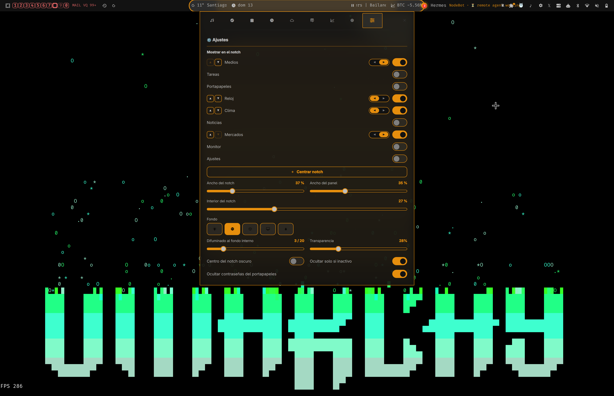
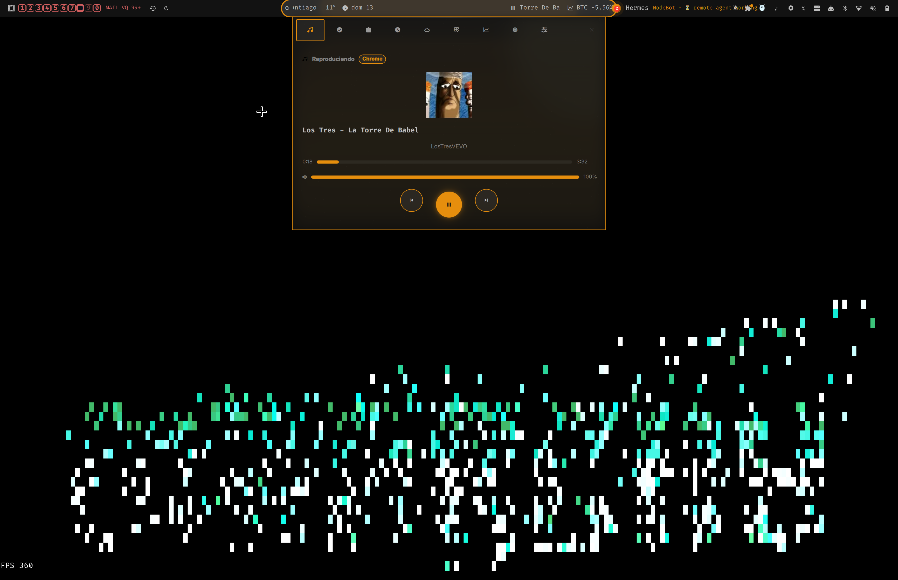
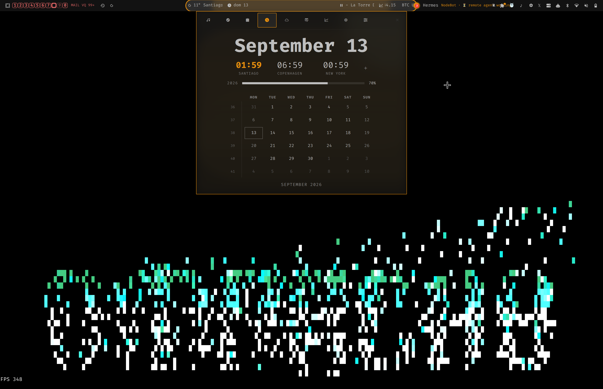
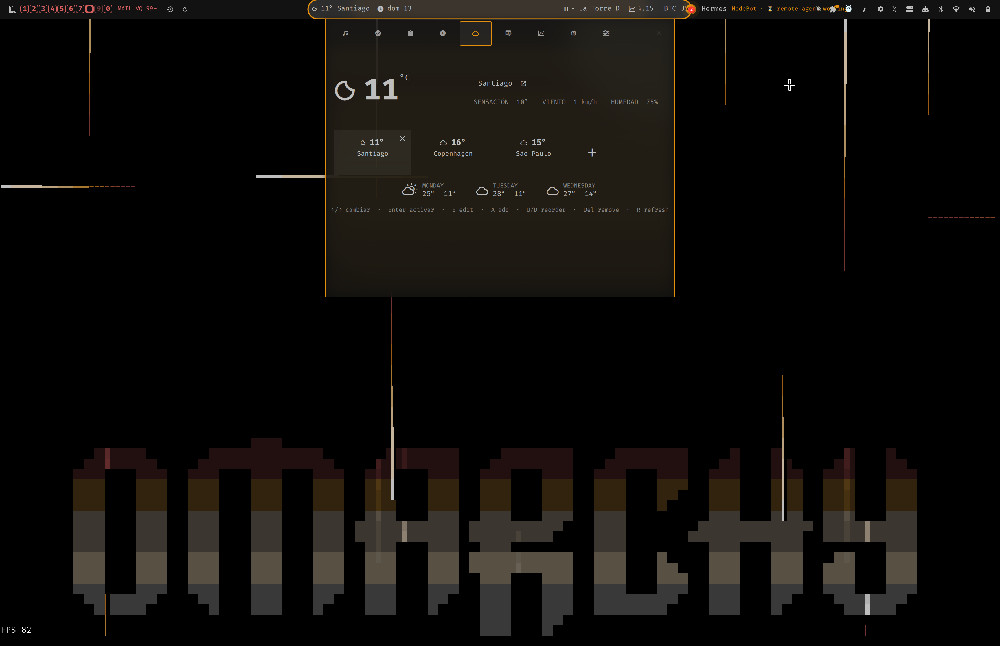
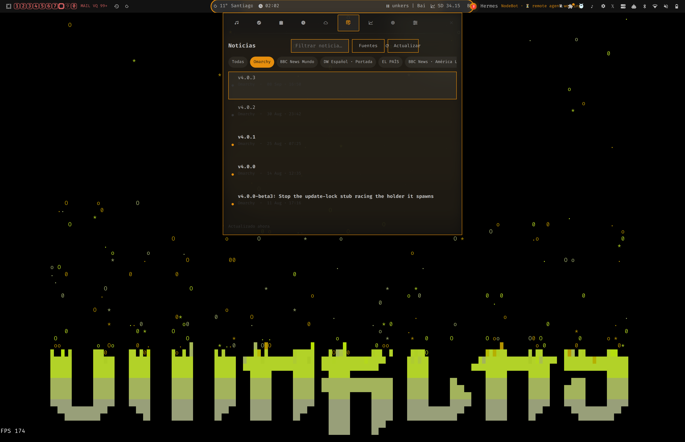
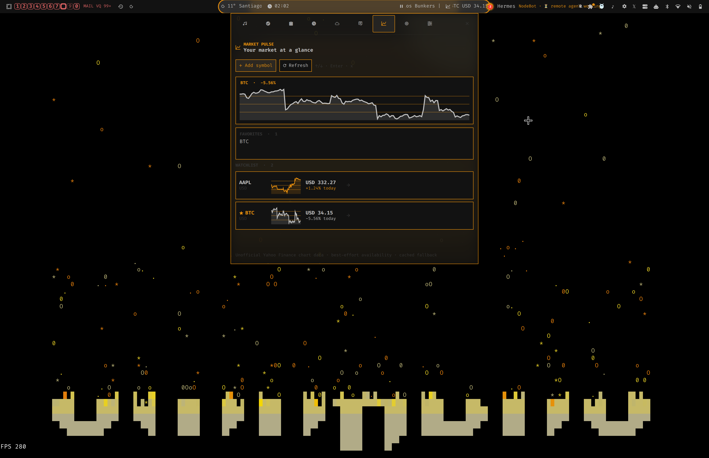
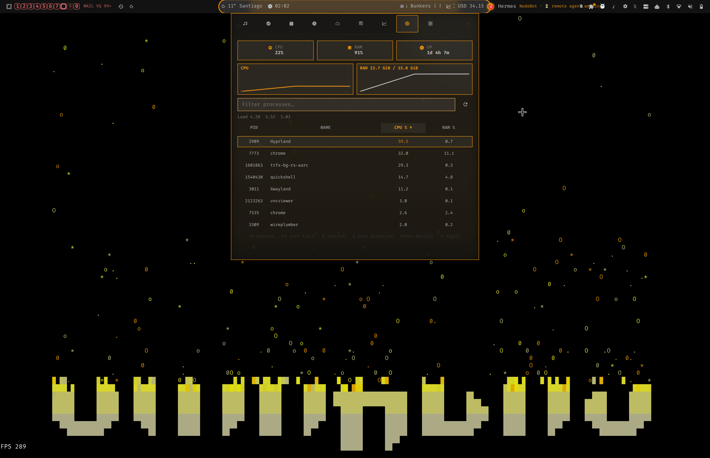

# SuperNotch

A theme-aware command center for Omarchy. SuperNotch adds a center bar pill that expands into a keyboard-friendly panel for media, world clocks, weather, clipboard history, news, markets, system monitoring, and settings.



## Highlights

- Centered notch pill with click-to-open behavior, live plugin status, configurable width, center gap, order, and left/right placement.
- Music controls through MPRIS, including track metadata, seeking, and transport controls.
- World clocks with timezone search and removal controls.
- Multi-city weather powered by Open-Meteo, with location management, forecasts, and a compact notch status.
- Clipboard history with sensitive-content masking and a persistent recording pause toggle.
- RSS and Atom news reader with saved sources and keyboard navigation.
- Market watchlist and optional portfolio lots, cached Yahoo Finance data, favorites-only notch ticker, animated price/percentage rotation, overview sparklines, and detail charts.
- Process monitor with CPU/RAM history, sortable columns, filtering, process details, and guarded TERM/KILL confirmations.
- All plugin glyphs use the configured Omarchy Nerd Font and surfaces follow Omarchy theme tokens.

## Screenshots

### Music



### Clocks



### Weather



### News



### Markets



### System monitor



## Install

```bash
omarchy plugin add io.github.avillagran.omarchy-supernotch https://github.com/avillagran/omarchy-supernotch
```

The plugin installs `SUPER + SHIFT + N` as its toggle shortcut. You can also click the center pill in the bar.

To remove it:

```bash
omarchy plugin remove io.github.avillagran.omarchy-supernotch
```

## Use

- Click the notch pill or press `SUPER + SHIFT + N` to open or close the panel.
- Click a tab to switch plugins. Press `1` through `9` to jump directly to a tab.
- Use Tab or Left/Right to move through tabs; Down enters plugin content.
- Press Escape to leave a plugin subview before closing SuperNotch.
- In Settings, choose which plugins are displayed in the notch and adjust their order and side.

## Keyboard plugin contract

Plugin authors expose `keyboardNavigationBlocked` only while a text editor owns keyboard input. Each plugin implements `handleKeyboardAction(action)` and returns whether it consumed the action. The panel routes these semantic actions:

- `"move"` for directional navigation.
- `"activate"` for the selected control.
- `"delete"` for the selected removable item.
- `"text"` for editing text content.
- `"back"` for leaving a subview or cancelling a modal state.

## Plugin layout

Each panel tab lives in `plugins/<key>/` and contains its `plugin.json`, QML user interface, and optional backend. New tabs are discovered automatically.

```text
plugins/
  music/       MPRIS player controls
  clock/       Calendar and world clocks
  clipboard/   Clipboard history
  weather/     Multi-city weather
  news/        RSS and Atom reader
  markets/     Watchlist and portfolio
  monitor/     CPU, RAM, and process monitor
  settings/    SuperNotch preferences
```

## Development checks

```bash
node --test tests/*.test.js
omarchy plugin validate .
```

The acceptance checklist for interactive keyboard testing is in `docs/plugins-keyboard-acceptance.md`.

## License

MIT
